# Firedog Architecture

## High-Level Overview

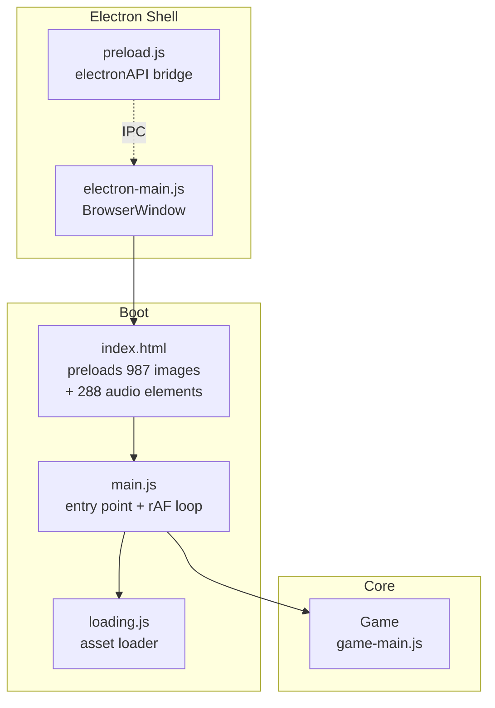

`main.js` calls `startLoadingScreen()` and, once `loading.finish()` resolves on `window.load`, constructs `new Game(...)` itself — `loading.js` never instantiates Game.

---

## Game Class — Top-Level Composition

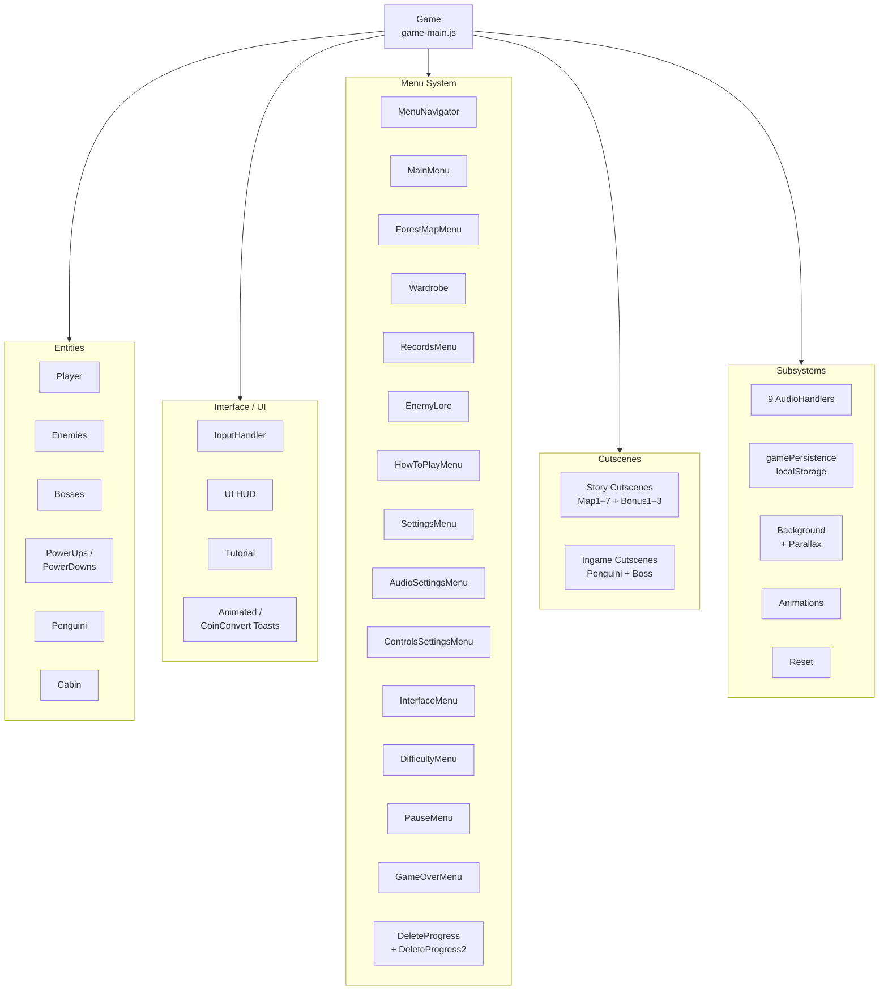

---

## Game Loop

The rAF loop in [main.js](game/main.js) switches on `game.gameState` — three states only, defined in [constants.js](game/config/constants.js):

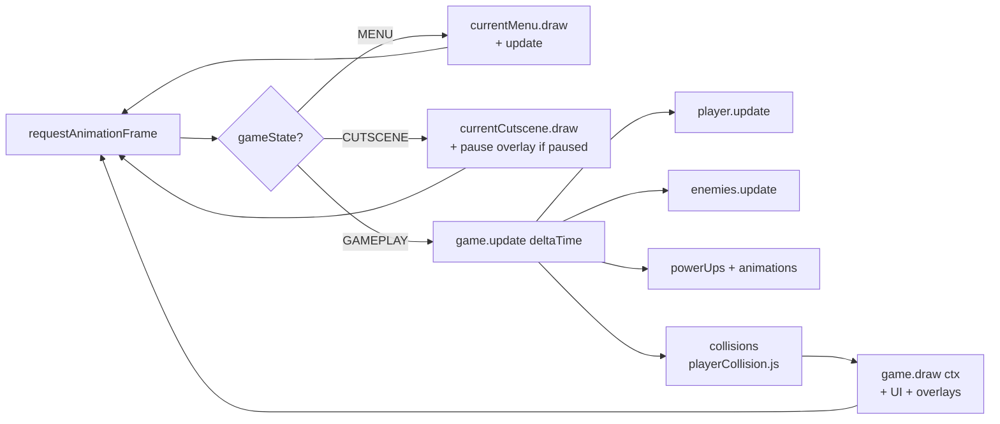

Game-over, pause, and distortion effects are drawn as overlays **within** GAMEPLAY — they are not separate top-level states.

---

## Player — State Machine

11 states defined in [playerStates.js](game/entities/playerStates.js) and enumerated in [PlayerState](game/config/constants.js) (0–10). Initial state is `Sitting` — both [game-main.js:97](game/game-main.js#L97) and [reset.js:50](game/reset.js#L50) set `currentState = states[0]` and `states[0]` is `Sitting`.

Transitions to `Standing` only happen when the world is stopped (cabin fully visible or boss visible); otherwise recovery lands in `Running`. `Hit` / `Stunned` / `Dying` can be entered from any state — triggered by [playerCollision.js](game/entities/playerCollision.js) and each state's `gameOver()` check — not from Standing specifically. `Hit` / `Stunned` recover to `Sitting` when `previousState === states[0]` (i.e. was Sitting).

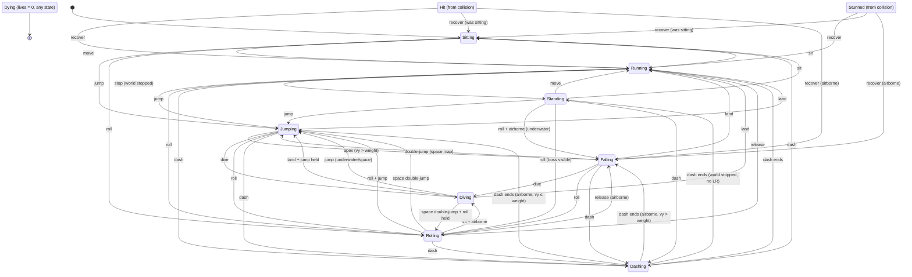

Files: [player.js](game/entities/player.js), [playerStates.js](game/entities/playerStates.js), [playerCollision.js](game/entities/playerCollision.js)

---

## Enemy Class Hierarchy

Base class: `Enemy` in [enemyBase.js](game/entities/enemies/core/enemyBase.js). Mixin subtypes in [enemyTypes.js](game/entities/enemies/core/enemyTypes.js). Bosses extend a shared `EnemyBoss` base.

```mermaid
classDiagram
    class Enemy {
        +x, y, width, height
        +update()
        +draw()
    }

    Enemy <|-- FlyingEnemy
    Enemy <|-- GroundEnemy
    Enemy <|-- ClimbingEnemy
    Enemy <|-- VerticalEnemy
    Enemy <|-- FallingEnemy
    Enemy <|-- UnderwaterEnemy
    Enemy <|-- EnemyBoss

    GroundEnemy <|-- MovingGroundEnemy
    GroundEnemy <|-- ImmobileGroundEnemy
    ImmobileGroundEnemy <|-- BurrowingGroundEnemy
    BurrowingGroundEnemy <|-- UndergroundEnemy
    FlyingEnemy <|-- BeeInstances

    EnemyBoss <|-- Elyvorg
    EnemyBoss <|-- Glacikal
    EnemyBoss <|-- NTharax

    class BossManager {
        +spawnBossIfNeeded()
        +bossIsEngaged()
        +bossGateReached()
        +onBossDefeated()
        +updateBossTimers()
        +updateScreenEffect()
    }
    BossManager --> Elyvorg
    BossManager --> Glacikal
    BossManager --> NTharax
```

Per-map enemies extend one of the mixin subtypes and live in [maps/](game/entities/enemies/maps/) (map1Enemies.js … bonusMap3Enemies.js).

---

## Menu Hierarchy

All menus extend `BaseMenu` in [baseMenu.js](game/menu/baseMenu.js); long/scrollable lists extend `ScrollableMenu`, which itself extends `BaseMenu`.

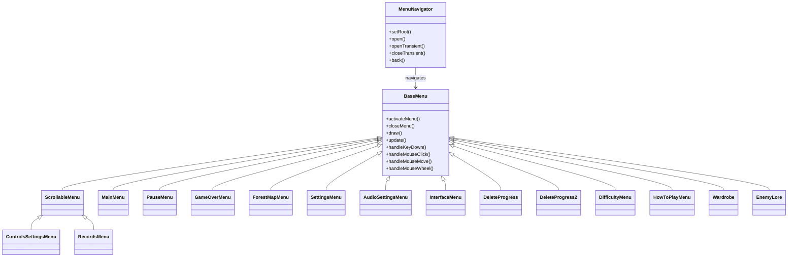

---

## Audio System

9 `AudioHandler` subclasses in [audioHandler.js](game/audioHandler.js):

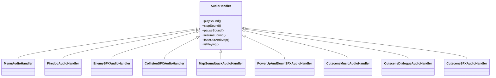

All 288 audio elements live as `<audio>` tags in [index.html](game/index.html) and are each referenced by id.

---

## Cutscene System

Base engine: `Cutscene` in [cutscene.js](game/cutscene/cutscene.js). Boss cutscenes share an intermediate `BossCutscene` base.

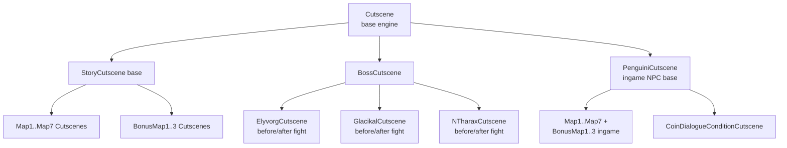

Dialogue, sprites, music, and SFX are orchestrated via `addDialogue()` in [cutscene.js](game/cutscene/cutscene.js).

---

## Persistence

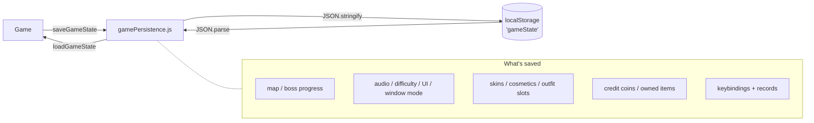

File: [gamePersistence.js](game/persistence/gamePersistence.js) — `clearSavedData()` also exists for full wipes.

---

## Config / Data Layer

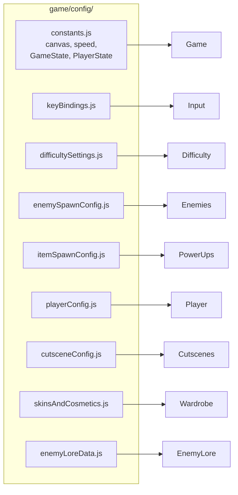

---

## Testing

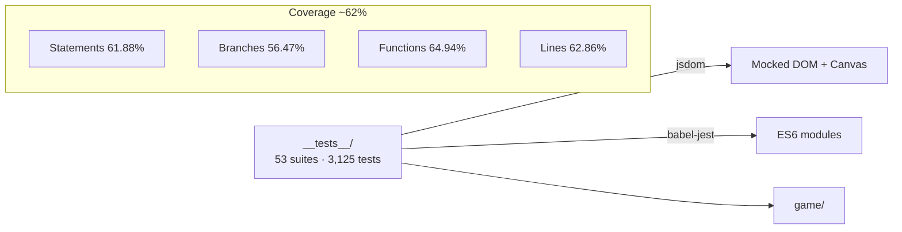
